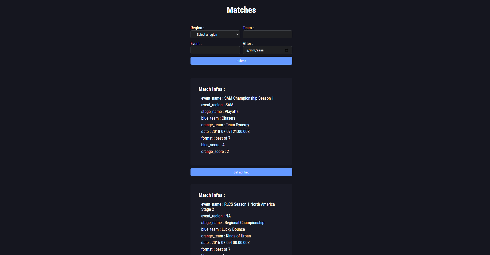
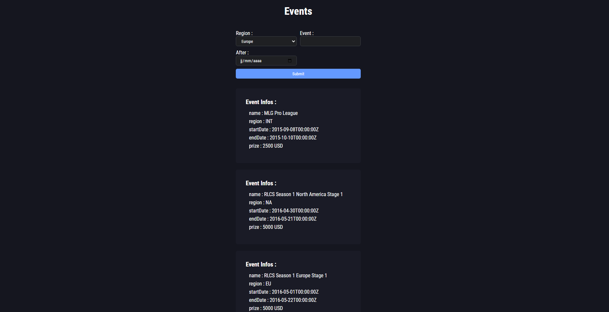

# RLCS SCRAPPER

## Description

This little project is a web app that shows some informations about Rocket League esport matches or tournaments.
Users can browse matches or events from the API with different filters, and choose the matches for which they want to be notified.

As the app is still in developpment, the front-end is very unfinished, and a bit ugly.

## Installation

1. Install the libraries :
   - [requests](https://pypi.org/project/requests/)    `pip install requests`
   - [datatime](https://docs.python.org/3/library/datetime.html)   `pip install datetime`
   - [flask](https://flask.palletsprojects.com/en/3.0.x/)    `pip install flask`

## Usage

Currently, you chan choose to run only the `main.py` file, or the entire flask app, by running `python -m flask run` in your terminal.
Once on the web app, you can navigate to the matches page or the events page, to start gather informations about everything you want.

On the matches page, you can filter matches by :
- Region
- Team
- Event
- Date

For every match on this page, you can choose to be notified to it, just by clicking the "Get notified" button.

Same for the events page, you can filter events by :
- Region
- Event Name
- Date

There is no notification button here because it's not necessary

## API

I'm using the [octane.gg](https://zsr.octane.gg/)'s API. It's an API that let you browse loads of interesting infos about everything that can happen in Rocket League esport (matches, events, teams, players, records, and a bunch of other stats).

## Contributing

- ⭐ Star this repository
- 🍴 Fork this repo
- 💻 Clone your forked repo
- ➕ Make your changes
- ✅ Commit, push
- ⌨️ Create a pull request
